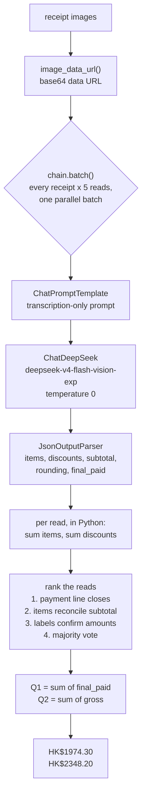

# FTEC5660 Homework 1: Receipt Chain

Build a LangChain pipeline that reads every supermarket receipt in a folder
with the vision-capable DeepSeek Flash model and answers these two questions:

1. How much money did I spend in total for these bills?
2. How much would I have had to pay without the discount?

For this homework, **amount spent** means the final payment after the receipt's
rounding line. **Without the discount** means the sum of the original positive
item prices: add back every promotion, coupon, member, app, packaging-damage,
and percentage discount, but do not add back rounding.

## Student task

Only edit the two functions in `hw1.py` that contain `### YOUR CODE HERE`:

- `build_chain()` creates your LangChain chain.
- `answer_queries()` runs the chain on the receipt images and returns one final
  response for each question.

You may use prompt chaining, routing, parallel calls, reflection, or a
combination. Your final responses should each contain one HKD amount. Do not
hard-code filenames or public answers; grading uses unseen receipt folders.

## Setup and public test

```bash
python3 -m venv .venv
source .venv/bin/activate
pip install -r requirements.txt
```

Put your DeepSeek key after `DEEPSEEK_API_KEY=` in `.env`, then run:

```bash
python3 hw1.py --image-folder public_test
```

The program creates `results.csv` in the current directory. Its columns are
`query`, `model_response`, and `correctness`. The public answers are in
`public_test/ground_truth.json`. The starter intentionally returns the dummy
response `please design your chain to answer these two queries.` so it runs
before you add any API code.

The required model is `deepseek-v4-flash-vision-exp`, the vision-capable
DeepSeek Flash model. JPEG, PNG, GIF, and WebP inputs are accepted by the
homework runner.


## Homework 1 solution

### Chain design



### Description

The model is used only to **transcribe**, never to calculate. Its prompt asks for
the printed lines of one receipt as JSON and explicitly forbids adding,
reconciling or adjusting any figure; every total is then summed in Python, where
the arithmetic cannot be hallucinated. This matters more than it sounds. An
earlier version of this chain told the model that `sum(items) - sum(discounts)`
had to equal the subtotal, and the model satisfied that requirement by misreading
a *second* line to compensate for a first misreading, producing a self-consistent
wrong answer that no check could detect. Every constraint in the final design is
therefore evaluated in Python after the fact, and none of them is ever revealed
to the model, so there is nothing for it to write its numbers towards.

Because a misread digit is not reproducible, each receipt is read five times in a
single parallel `batch` call and the reads are reconciled against one another.
Three independent pieces of evidence rank them. First, a read must satisfy
`subtotal + rounding == final_paid`, which validates the payment line. Second,
Query 2 needs the bill before discounts, and the receipt states that figure
twice -- as `subtotal + discounts`, and as the item lines at their printed
prices -- so reads whose two versions agree are preferred, since only a read that
got the whole receipt right can reconcile both. Third, most Hong Kong supermarket
discounts are labelled with their own value (`Buy 3 Save $9.8`,
`MB APP UPGRADE -$10`), so the label independently confirms the amount column,
and a read that misreads the column loses that agreement and loses its vote.
Whatever survives is decided by majority vote, field by field. `answer_queries`
never raises, so even a total API failure still writes `results.csv`.

